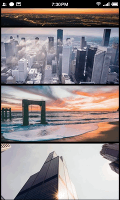
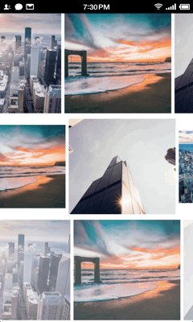
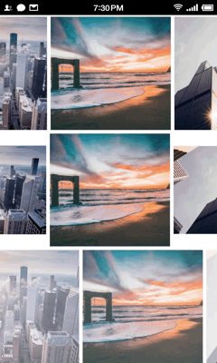

# ImageSliding

Scrollimage slide image - extends ImageView, and provides parallax effects when it scrolls in the screen.It can be use in any view which can scroll its content, like ListView, RecyclerView, ScrollView, etc.

## ScreenShots










## Include ScrollParallaxImageView to Your Project

With gradle:

```groovy
dependencies {
   compile 'com.gjiazhe:scrollparallaximageview:1.0'
}
```

## Use ScrollParallaxImageView in Layout File Just Like ImageView

```xml
<com.gjiazhe.scrollparallaximageview.ScrollParallaxImageView
    android:id="@+id/img"
    android:layout_width="match_parent"
    android:layout_height="180dp"
    android:src="@drawable/pic1"
    android:scaleType="centerCrop" />
```

## Set the Parallax Style in Java Code

```java
ScrollParallaxImageView iv = (ScrollParallaxImageView) findViewById(R.id.img);
iv.setParallaxStyles(new VerticalMovingStyle()); // or other parallax styles
```

There are several Parallax Styles in the library, but you can also custom  yourself.  Just create a class implements the interface `ScrollParallaxImageView.ParallaxStyle` :

```java
public class MyParallaxStyle implements ScrollParallaxImageView.ParallaxStyle {
  @Override
    public void transform(ScrollParallaxImageView view, Canvas canvas, int x, int y) {
        // Transform the view here, x and y stands for the coordinate of
        // ScrollParallaxImageView's top-left corner.
    }
  
    @Override
    public void onAttachedToImageView(ScrollParallaxImageView view) {
		// Do something when the style is set to a ScrollParallaxImageView.
    }

    @Override
    public void onDetachedFromImageView(ScrollParallaxImageView view) {
		// Do something when the style is remove from a ScrollParallaxImageView.
    }
}
